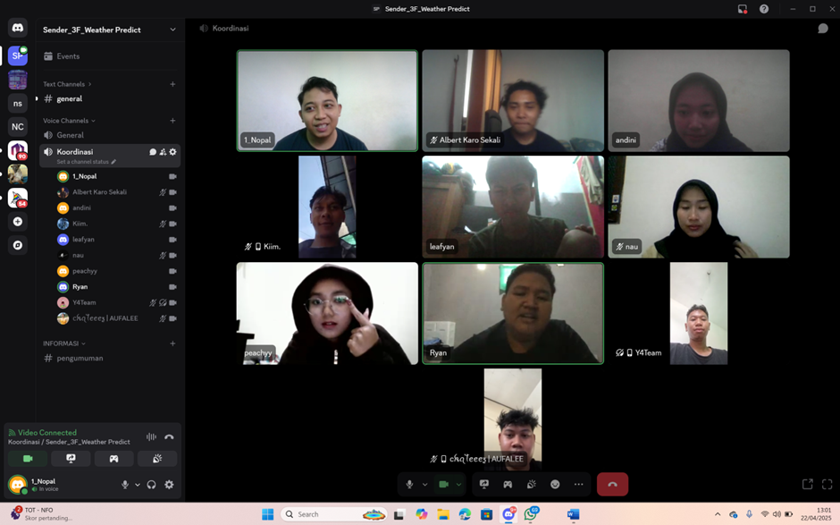

# Sender_3F_WeatherPredict
****

**Colaborators=**
- Ketua Kelompok= Naoval
- Supervisior= Andin
- Supervisior= Ajul

**Anggota=** 
- Syafiq
- Albert 
- Ferry
- Miko
- Zein
- Naurotur
- Ryan

**Metode= FDD(Feature-Driven Development)**

**Fitur=** 
- Chat Bot(Jika ditanya besok atau 2 hari lagi di Jakarta bagaimana cuacanya?)
- Integrasi GPS**
- Home Page(Perjam ada prediksi cuaca,ikon(mendung,cerah,hujan,dll))
- Setting(Akun,satuan suhu,dark dan light theme)